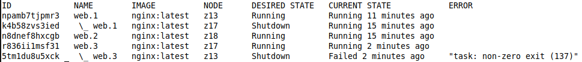

# TP4

## On rase presque tout

```bash
docker swarm leave --force
docker rm --force $(docker ps -aq)
```

## Organisation

### Host

```bash
docker swarm init --advertise-addr 10.0.228.13 # This will give you a token
nc -l -p 9000 # Create a "chat room" to send token
# Paste token
```

### Workers

```bash
nc 10.0.228.13 9000 # Copy token
docker swarm join --token [TOKEN] 10.0.228.13:PORT
```

## Créer un service

```bash
docker pull nginx
docker service create --name web --replicas 3
```

Automatically, replicas=1. Balanced across swarm automatically (host included).

## Check services

### Host

```bash
docker service ls
docker service ps
```
docker service ls


docker service ps web


### Workers

```bash
docker ps
```

## Tolérance aux pannes

### Worker

#### Leave swarm

```bash
docker swarm leave
```

### Host

#### Check services

```bash
docker service ls
docker node ls      
docker service ps
```

docker service ls


docker node ls


docker service ps web


Normally, you'd see the web service has been balanced across the remaining workers.

#### Worker rejoins

```bash
docker swarm join --token [TOKEN] 10.0.228.13:PORT
```

### Host

docker service ls


docker node ls


docker service ps web


### Rebalance swarm

#### Remove extra load on most loaded machine (2 containers)

```bash
docker rm --force web.x.blablah
```

`SERVICE_NAME` should be something like `web.[INDEX]` where `[INDEX]` is a number.

You can see that now there is a 'ready' worker but a missing instance.

docker service ls


docker node ls


docker service ps web


The load is automatically rebalanced :



## Suum cuique

### Create file on each instance

For each instance, get their ID with `docker node ls`

```bash
docker exec -it [ID] /bin/bash
echo "<h1>Hello</h1>" > /usr/share/nginx/html/me.html
chmod 777 /usr/share/nginx/html/me.html
```

### Publish port

```bash
docker service update --publish-add 8080:80 web
```

Check if the manipulation was successful in your browser : http://[INSTANCE_IP]/me.html

## Misc

### Update load

```bash
docker service scale web=3
```

