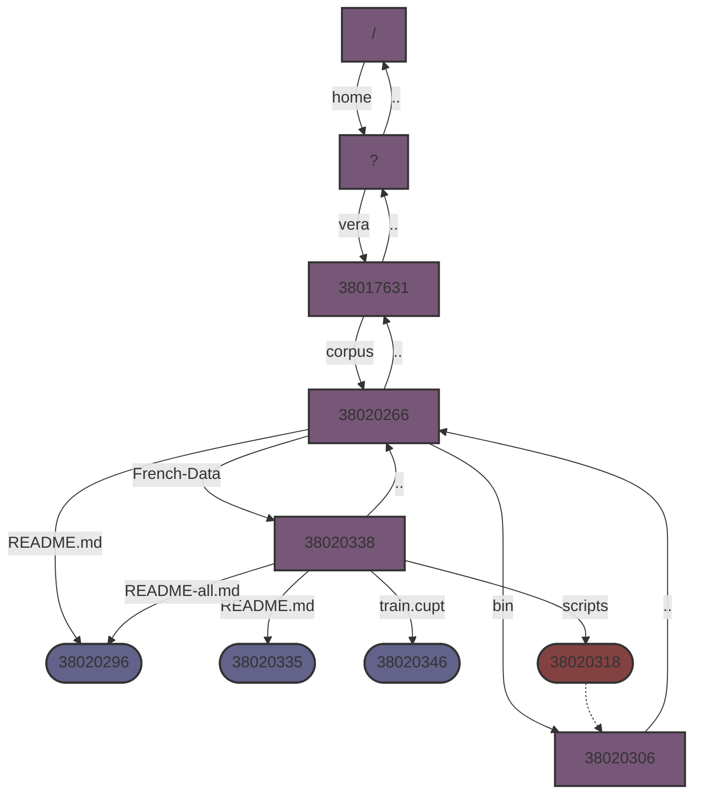
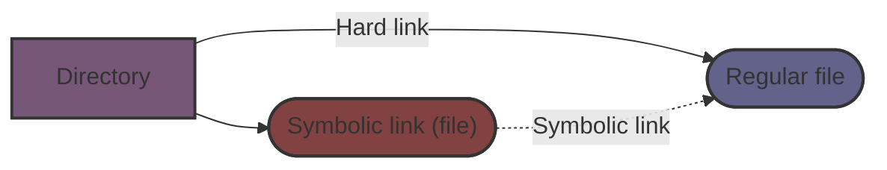

# Lab 1

File system. Introduction to shell programming.

## 1. Understanding soft and hard links

### a. What is an i-node? Which command allows you to know the i-node of a given file or directory?

> An i-node ???

```bash
ls -i   # Shows i-node numbers
ls -I   # Shows number of hard links toward file
```

### b. Recall the difference between a symbolic and a hard link. Which command shows hard and symbolic links in a directory?

> A symbolic link ???
>
> A hard link ???

### c. Users `U1` and `U2` share the file `f` via hard links. User `U1` does not need his file any more and deletes it from his directory (we suppose that he has the right to do so). Can `U2` still use `f`? Why?

> `U2` can still use the file `f` because there is
> one hard link to the file remaining.

### d. Same question as in `1c` but this time `U1` and `U2` access the file `f` via a hard and a symbolic link, respectively.

> `U2` cannot use the file `f` because there is no hard link to
> the file remaining, and the symlink will return a nonexistent path.

### e. Same question as in `1c` but this time `U1` and `U2` access the file `f` via a symbolic and a hard link, respectively.

> `U2` can still use the file `f` because there is
> one hard link to the file remaining. The destruction
> of the symlink has no impact on the file.

### f. Give examples of Linux commands which create hard links.

```bash
ln
mkdir
touch
cp
mv
```

### g. Study the session in the Appendix. It shows the first directory tree created by Vera for her corpus.

#### i. Draw this extract of the file system.

Represent directories as rectangles, regular files and symbolic links as
ovals, hard links as solid arrows and symbolic links as dashed arrows.

Each arrow should go from the directory to the destination file (not the opposite!).

**Graph**



**Legend**

All files and directories are named in the graph by their i-node number.



#### ii. Note that each directory, even empty, has at least two entries (hard links): itself and its parent. On this basis, complete your image with the missing hard links.

#### iii. Check that each file in your image has exactly as many hard links pointing at it as shown by the `ls -lia` command.

Pay special attention to directories and to the files `README-all.md` and
`README.md`. This should bring you to reconsidering what really is a name 
of a file.

## 2. Handling files and directories with a simple script

Consider again the directory tree from the Appendix.

### a. Give the list of commands allowing you to create the same directory tree in your home directory.

You and your group should have the same file permissions as vera and
linguists. Put down the appropriate commands in the gray box.

```bash
mkdir ~/corpus
chmod 755 corpus

cd ~/corpus
mkdir bin French-data
chmod 755 bin French-data

touch README.md bin/README.md
chmod 644 README.md

cd French-data
touch README.md train.cupt
chmod 755 README.md
chmod 644 train.cupt

ln -s ../bin scripts
ln ../README.md README-all.md
```

### b. ransform the list of commands to a bash script containing comments, as recommended in Lecture 3.

This includes:
- in the first line, after `#!`, the shell to be used to execute the script (you can find it with the `which` bash command, for example `#!/usr/bin/bash`,
- a header comment describing what the script does and which parameters it takes (here: none); this resembles a function documentation in C++ programming (input, output, contents),
- comments for each logical block of the script,
- messages for the user to inform her what the script is doing

>See file [makeTree.sh](./makeTree.sh)

## Appendix

```ruby
[vera@szymborska][~/corpus]$ pwd
/home/vera/corpus
```

```ruby
[vera@szymborska][~/corpus]$ ls -lia
total 20
38020266 drwxr-xr-x 4 vera linguists 4096 juil . 24 17:36 .
38017631 drwxr-xr-x 5 vera linguists 4096 juil . 24 17:35 ..
38020306 drwxr-xr-x 2 vera linguists 4096 juil . 24 17:35 bin
38020338 drwxr-xr-x 2 vera linguists 4096 juil . 25 19:46 French-data
38020296 -rw-r--r-- 2 vera linguists 101  juil . 24 17:36 README.md
```

```ruby
[vera@szymborska][~/corpus]$ ls -ila bin/French-data/
bin/:
total 8
38020306 drwxr-xr-x 2 vera linguists 4096 juil . 24 17:35 .
38020266 drwxr-xr-x 4 vera linguists 4096 juil . 24 17:36 ..

French-data/:
total 16
38020338 drwxr-xr-x 2 vera linguists 4096 juil . 25 19:46 .
38020266 drwxr-xr-x 4 vera linguists 4096 juil . 24 17:36 ..
38020296 -rw-r--r-- 2 vera linguists 101  juil . 24 17:36 README-all.md
38020335 -rw-r--r-- 1 vera linguists 94   juil . 24 17:36 README.md
38020318 lrwxrwxrwx 1 vera linguists 6    juil . 24 17:40 scripts -> ../ bin
38020346 -rw-r--r-- 1 vera linguists 0    juil . 25 19:46 train.cupt
```

```plaintext
[vera@szymborska][~/corpus]$ cat README.md
This is the README file from the multiword expressions (MWEs)
corpus for all languages, edition 1.4.
```

```plaintext
[vera@szymborska][~/corpus]$ cat French-data/README.md
This is the README file from the multiword expressions ( MWEs )
corpus for French, edition 1.4.
```
