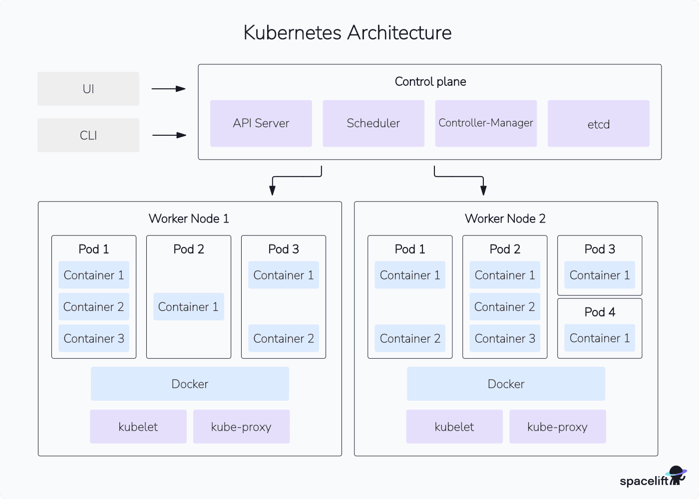

# Virtualisation - TP2

> [!TIP]
>
> Avant de commencer, il est vivement recommandé d’ajouter
> à la fin de votre fichier ~/.bashrc la ligne suivante: \
> `./usr/share/bash-completion/bash_completion` \
> et utiliser la touche **Tab** pendant l’édition de vos commandes. \
> Même chose: \
> `source <(kubectl completion bash)`
> et
> `source <(minikube completion bash)`

## 1. Découverte de Kubernetes

### 1.1. Lancement de premier cluster K8s (shorthand for Kubernetes)

Minikube

Pour lancer un cluster:

```bash
minikube start
```

Pour supprimer un cluster:

```bash
minikube delete
```

Pour se connecter à la VM en ssh:

```bash
minikube ssh
```

Tableau de bord Kubernetes:

```bash
minikube dashboard
```

#### 1.1.1. Explorons notre cluster k8s

```bash
$ kubectl get nodes

NAME       STATUS   ROLES           AGE     VERSION
minikube   Ready    control-plane   4m29s   v1.34.0
```

```bash
$ kubectl get pod

No resources found in default namespace.
```

```bash
$ kubectl get services

NAME         TYPE        CLUSTER-IP   EXTERNAL-IP   PORT(S)   AGE
kubernetes   ClusterIP   10.96.0.1    <none>        443/TCP   9m25s
```

To create a deployment to manage a pod:

```bash
kubectl create deployment nginx-deployment --image=nginx
```

### 1.2. Passez les commandes suivantes

```bash
$ kubectl get deployment

NAME               READY   UP-TO-DATE   AVAILABLE   AGE
nginx-deployment   1/1     1            1           79s
```

```bash
$ kubectl get replicaset

NAME                          DESIRED   CURRENT   READY   AGE
nginx-deployment-7457467ffd   1         1         1       21m
```

```bash
$ kubectl get pod

NAME                                READY   STATUS    RESTARTS   AGE
nginx-deployment-7457467ffd-nqqnq   1/1     Running   0          21m
```

> On constate que Kubernetes fonctionne avec des *__K8s objects__*.
> Ils sont organisés *top-down* de la façon suivante:
>
> | K8s Object  | Description                            |
> |:------------|:---------------------------------------|
> | Nodes       | Instance Kubernetes (Master ou Worker) |
> | ReplicaSets | Répartit le *load* sur un/plusieurs pods |
> | Pods        | Contient un ou plusieurs *containers*    |
> | Containers  | Un conteneur Docker                    |

Pour illustrer le propos:



## 2. Exposer un service

Utilisez kubectl expose pour exposer le service `nginx`
avec l’option `NodePort`:

```bash
kubectl expose deployment nginx-deployment --type=NodePort --port=8080 --target-port=80
```

Vérifiez que le service est bien créé.

```bash
kubectl get service
```

Expliquer pourquoi nous utilisons ces deux ports.

> On utilise ces deux ports pour utiliser le port 80 du conteneur nginx,
> et le port 8080 côté client pour ne pas utiliser de ports réservés au système.

Vérifiez que votre service est bien exposé avec la commande

```bash
minikube service nginx-deployment --url
```

Pour scaler (mettre à l’échelle) votre déploiement, `kubectl` permet
d’ajuster le nombre de replicas d’un déploiement avec `kubectl scale`.

Répliquez votre déploiement de nginx 3 fois et vérifiez leurs disponibilités.

```bash
kubectl scale --replicas 3 deployment nginx-deployment
```

À la fin de cette section, supprimez tous les déploiements.

```bash
kubectl delete deployment nginx-deployment
kubectl delete service nginx-deployment
```

## 3. Connecter les applications aux services en YAML

### 3.1. Création d’un déploiement

Dans cette section, nous allons utiliser le deuxième type de service ClusterIP pour
déployer un service à l’intérieur du cluster.

> Cf. `nginxdep.yaml`

> [!TIP]
>
> Pour interpréter le contenu de ce fichier, faites référence au cours.
> Le fichier YAML est sensible à la casse et à l’espace.
>
> Pour vérifier la conformité de votre fichier, utilisez un validateur des
> fichiers YAML comme : https://www.yamllint.com/.

- Créez le déploiement à partir de ce fichier en exécutant `kubectl apply`, et vérifiez votre déploiement.

```bash
kubectl apply -f nginxdep.yaml
```

- Vérifiez l’état de vos pods et leurs adresses IP:

```bash
$ kubectl get pods -o wide
NAME                       READY   STATUS    RESTARTS   AGE     IP           NODE       NOMINATED NODE   READINESS GATES
my-nginx-7d9b55c9f-5p4zt   1/1     Running   0          3m12s   10.244.0.9   minikube   <none>           <none>
my-nginx-7d9b55c9f-wc5h4   1/1     Running   0          3m12s   10.244.0.8   minikube   <none>           <none>
```

### 3.2. Création de service

Pour exposer le déploiement précédent, il faut le lier à un service.

> Cf. `nginx-service.yaml`

```bash
kubectl apply -f nginx-service.yaml
```

- Vérifiez la bonne création de ce service et puis obtenez les détails de votre déploiement en exécutant

```bash
$ kubectl describe svc my-nginx
Name:                     my-nginx
Namespace:                default
Labels:                   run=my-nginx
Annotations:              <none>
Selector:                 run=my-nginx
Type:                     ClusterIP
IP Family Policy:         SingleStack
IP Families:              IPv4
IP:                       10.101.94.169
IPs:                      10.101.94.169
Port:                     <unset>  80/TCP
TargetPort:               80/TCP
Endpoints:                10.244.0.9:80,10.244.0.8:80
Session Affinity:         None
Internal Traffic Policy:  Cluster
Events:                   <none>
```

### 3.3. Accéder au service

Pour accéder au service qu’on vient de créer en interne à partir de ces deux
pods, il faut passer la commande suivante et vérifier les résultats.

```bash
$ kubectl exec -ti my-nginx-7d9b55c9f-5p4zt -- curl 10.244.0.9:80
<!DOCTYPE html>
<html>
<head>
<title>Welcome to nginx!</title>
<style>
html { color-scheme: light dark; }
body { width: 35em; margin: 0 auto;
font-family: Tahoma, Verdana, Arial, sans-serif; }
</style>
</head>
<body>
<h1>Welcome to nginx!</h1>
<p>If you see this page, the nginx web server is successfully installed and
working. Further configuration is required.</p>

<p>For online documentation and support please refer to
<a href="http://nginx.org/">nginx.org</a>.<br/>
Commercial support is available at
<a href="http://nginx.com/">nginx.com</a>.</p>

<p><em>Thank you for using nginx.</em></p>
</body>
</html>
```

### 3.4. Explorer les pods

Lorsqu’un pod s’exécute sur un noeud, le kubelet ajoute un ensemble de variables
d’environnement pour chaque service actif.

Exécutez les commandes suivantes pour les deux pods:

```bash
$ kubectl exec my-nginx-7d9b55c9f-5p4zt -- printenv | grep SERVICE
KUBERNETES_SERVICE_HOST=10.96.0.1
KUBERNETES_SERVICE_PORT=443
KUBERNETES_SERVICE_PORT_HTTPS=443

$ kubectl exec my-nginx-7d9b55c9f-wc5h4 -- printenv | grep SERVICE
KUBERNETES_SERVICE_HOST=10.96.0.1
KUBERNETES_SERVICE_PORT=443
KUBERNETES_SERVICE_PORT_HTTPS=443
```

et puis passez les commandes suivantes :

```bash
kubectl scale deployment my-nginx --replicas=0
kubectl scale deployment my-nginx --replicas=2
```

```bash
$ kubectl get pods -o wide
NAME                       READY   STATUS    RESTARTS   AGE   IP            NODE       NOMINATED NODE   READINESS GATES
my-nginx-7d9b55c9f-m59lv   1/1     Running   0          33s   10.244.0.11   minikube   <none>           <none>
my-nginx-7d9b55c9f-pctk6   1/1     Running   0          33s   10.244.0.10   minikube   <none>           <none>
```

Que constatez-vous ?

> Les pods précédents ont été remplacés (supprimés / créés).

Visualisez encore une fois les variables d’environnement de
ces deux pods et justifiez votre constat.

```bash
$ kubectl exec my-nginx-7d9b55c9f-m59lv -- printenv | grep SERVICE
KUBERNETES_SERVICE_HOST=10.96.0.1
KUBERNETES_SERVICE_PORT=443
KUBERNETES_SERVICE_PORT_HTTPS=443
MY_NGINX_SERVICE_HOST=10.101.94.169
MY_NGINX_SERVICE_PORT=80
```

```bash
$ kubectl exec my-nginx-7d9b55c9f-pctk6 -- printenv | grep SERVICE
KUBERNETES_SERVICE_HOST=10.96.0.1
MY_NGINX_SERVICE_PORT=80
KUBERNETES_SERVICE_PORT=443
KUBERNETES_SERVICE_PORT_HTTPS=443
MY_NGINX_SERVICE_HOST=10.101.94.169
```

> On voit bien que les variables environnement ont changé.

Visualisez votre dashboard pour voir les changements.

> [!NOTE]
>
> Pour accéder à votre pod, utilisez la commande suivante:
>
> `kubectl exec -it <nom-de-pod/> -- /bin/bash`

## 4 Persistent Volume

Vous pouvez exécuter une application *stateful* en créant un
Deployment Kubernetes et en le connectant à un *PersistentVolume*
existant à l’aide d’un *PersistentVolumeClaim*.

> Cf. `mysql-service.yaml`