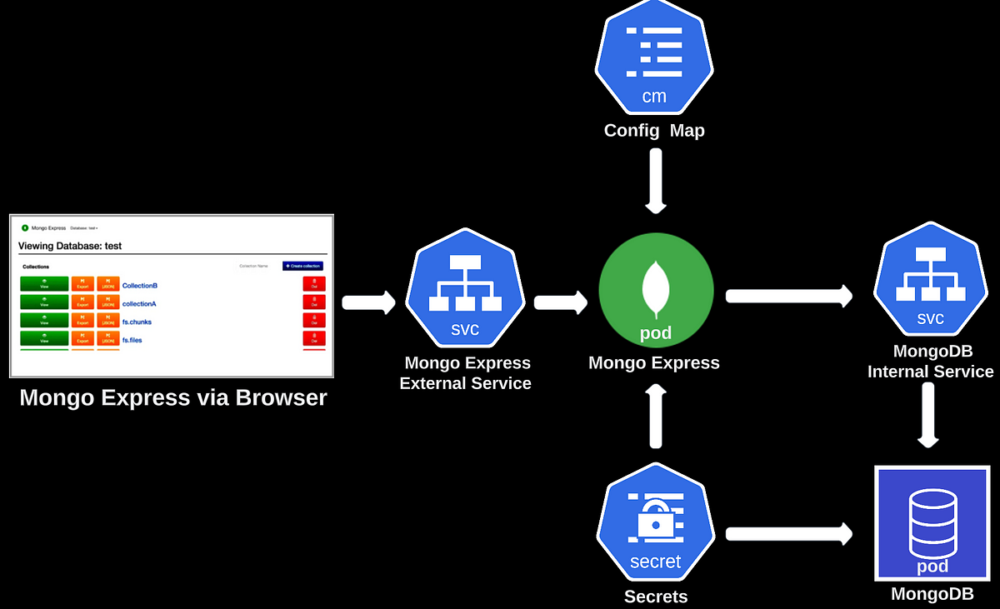

# Virtualisation - TP3

> [!TIP]
>
> Avant de commencer, il est vivement recommandé d’ajouter
> à la fin de votre fichier ~/.bashrc la ligne suivante:
> `./usr/share/bash-completion/bash_completion`
> et utiliser la touche **Tab** pendant l’édition de vos commandes.
> Même chose:
> `source <(kubectl completion bash)`
> et
> `source <(minikube completion bash)`

## 1. Déploiement d’une Application

### 1.1. Lancement de premier cluster K8s

Pour créer un cluster local, lancez `minikube`.

```bash
minikube start
```
### 1.2. Déploiement de MongoDB



Créez un déploiement dans votre répertoire personnel avec un fichier YAML.

> Cf. [`mongo.yaml`](./mongo.yaml)

Dans la partie qui concerne le pod, cherchez l’image (image) de conteneur
de la base de données mongo ainsi que le numéro de port (containerPort)
sur lequel il écoute et mettez à jour ces valeurs.

Comme d’habitude, nous cherchons ces valeurs sur
[Docker Hub](https://hub.docker.com/).

> - Image: [Mongo](https://hub.docker.com/_/mongo) (on cherche dans les images officielles)
> - No. de port: **27017**

Pour accéder à la base de données mongo, nous allons avoir
besoin de nom de l’utilisateur et le mot de passe.

Il faut indiquer ces deux paramètres et leurs valeurs à la
fin du fichier de déploiement, mais laissez leur valeur vide.

> Depuis la documentation sur Docker Hub, on trouve:
> - `MONGO_INITDB_ROOT_USERNAME`
> - `MONGO_INITDB_ROOT_PASSWORD`

Sauvegarder le fichier sans le déployer, car nous le mettons à
jour à fur et mesure.

## 2. Déploiement d’un service interne

Pour que mongoDB soit accessible dans le cluster, il faut le
définir comme service.

Dans le même fichier mongo.yaml, rajoutez à la fin les lignes
suivantes, et n’oubliez pas les trois tirets (`---`) qui indiquent
le début d’un nouveau fichier dans YAML.

Appliquez les changements et vérifiez la bonne création de service.

```bash
kubectl apply -f mongo.yaml
```

Récupérez l’adresse IP de pod.

```bash
$ kubectl get pods -o custom-columns=':.metadata.name,:.status.podIP'
                                      
mongodb-deployment-5b9f57575b-9x7sx   10.244.0.3
```

Pour vérifier le tout, passez cette commande:

```bash
kubectl get all
```

## 3. Déploiement de secret

> [!WARNING]
>
> Pour des raisons de sécurité, nous n’allons pas mettre les
> deux valeurs précédentes en claire, mais nous allons les chiffrer
> en utilisant l’object `secret` de kubernetes qui permet de stocker
> et de gérer des informations sensibles.

> Cf. [`mongo-secret.yaml`](./mongo-secret.yaml)

Cherchez la signification de mot `Opaque`.

> Le mot *Opaque* désigne un type de secret. *Opaque* est le type
> par défaut de secret, sous forme clé-valeur. *Opaque* souligne
> la protection (obfuscation) de la variable environnement

On stocke le nom de l’utilisateur et le mot de passe chiffré
au format Base 64:

```bash
echo -n "app-db" | base64
echo -n "app-user" | base64
```

On remplit les valeurs dans le fichier YAML, puis on applique:

```bash
kubectl apply -f mongo-secret.yaml
```

On vérifie:

```bash
$ kubectl get secret

NAME             TYPE     DATA   AGE
mongodb-secret   Opaque   2      5s
```

On met à jour le fichier [`mongo.yaml`](./mongo.yaml), puis on applique:

```bash
kubectl apply -f mongo.yaml
```

## 4. Déploiement de Mongo Express

On créée [`mongo-express.yaml`](./mongo-express.yaml) en reprenant
la même structure que pour **MongoDB**.

> Même procédé:
> - Image: `mongo-express` (Image officielle)
> - Port: **8081**
> - Variables environnement:
>   - `ME_CONFIG_MONGODB_ADMINUSERNAME`
>   - `ME_CONFIG_MONGODB_ADMINPASSWORD`
>   - `ME_CONFIG_MONGODB_URL` *(équivaut à `ME_CONFIG_MONGODB_SERVER` + `ME_CONFIG_MONGODB_PORT`)*

On remarquera que que l'url du service **MongoDB** est accédée
via la *configMap* du service.

```bash
kubectl apply -f mongo-express.yaml
```

## 5. Déploiement d’un service externe

On rajoute la configuration du service `mongo-express` à la fin
du fichier YAML en utilisant les trois tirets comme précédemment:

```yaml
---
apiVersion: v1
kind: Service
metadata:
  name: mongo-express-service
spec:
  selector:
    app: mongo-express
  type: LoadBalancer
  ports:
    - protocol: TCP
      port: 8081
      targetPort: 8081
      nodePort: 30000
```

Puis on applique la modification:

```bash
kubectl apply -f mongo-express.yaml
```

## 6. Déploiement d’un ConfigMap

Pour référencer notre `ConfigMap` dans le pod `mongo-express`,
on créée un fichier [`mongo-configmap.yaml`](./mongo-configmap.yaml):

```yaml
apiVersion: v1
kind: ConfigMap
metadata:
  name: mongodb-configmap
data:
  database_url: ???
```

On commaît le nom d'hôte et le port, donc l'url est
[mongodb-service:27017](mongodb-service:27017).

On applique:

```bash
kubectl apply -f mongo-configmap.yaml
kubectl apply -f mongo-express.yaml
```

Et on vérifie le bon fonctionnement:

```bash
$ kubectl get deployments

NAME                 READY   UP-TO-DATE   AVAILABLE   AGE
mongo-express        1/1     1            1           9m43s
mongodb-deployment   1/1     1            1           62m
```

On assigne une adress IP externe au service `mongo-express`:

```bash
minikube service mongo-express-service
```

Et on est redirigés sur le navigateur Web.

## 7. À vous de jouer

Don't have time >:(
