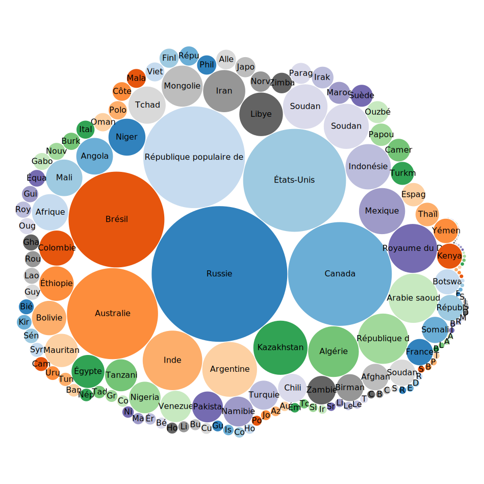

# TP2

Introduction à Wikidata

---

## Requêtes

### 1. Compter 

Listez le nombre d’humains présents dans Wikidata.

```js
SELECT (COUNT(*) AS ?count)
WHERE {
  ?item wdt:P31 wd:Q5 .
}
```

### 2. Comparer

Classez les pays par leur surface.

Visualisez le résultat avec la vue 'Bubble Chart'.

```js
SELECT ?countryLabel ?area
WHERE {
  SERVICE wikibase:label { bd:serviceParam wikibase:language "fr,en". }
  ?country wdt:P31 wd:Q6256 .
  ?country wdt:P2046 ?area .
}
ORDER BY DESC(?area)
LIMIT 10
```



| countryLabel                  | area                      |
|:------------------------------|--------------------------:|
| Russie                        | 17 075 400 km<sup>2</sup> |
| Canada                        | 9 984 670 km<sup>2</sup>  |
| États-Unis                    | 9 826 675 km<sup>2</sup>  |
| République populaire de Chine | 9 596 961 km<sup>2</sup>  |
| Brésil                        | 8 515 767 km<sup>2</sup>  |
| Australie                     | 7 692 024 km<sup>2</sup>  |
| Inde                          | 3 287 263 km<sup>2</sup>  |
| Argentine                     | 2 780 400 km<sup>2</sup>  |
| Kazakhstan                    | 2 724 900 km<sup>2</sup>  |
| Algérie                       | 2 381 741 km<sup>2</sup>  |


### 3. Explorer

Affichez toutes les capitales européennes. Essayez la vue 'Map'.

```js
SELECT ?countryLabel ?capitalLabel ?geoPoint
WHERE {
  SERVICE wikibase:label { bd:serviceParam wikibase:language "fr,en". }
  ?country wdt:P31 wd:Q6256;
           wdt:P36 ?capital .
  
  ?capital wdt:P625 ?geoPoint
}
```

View map: [**`capitals.geojson`**](./capitals.geojson)

### 4. Analyser

Quel continent compte le plus de lauréats du prix Nobel ?

Essayez la vue 'Area Chart'.

```js
SELECT ?continentLabel (COUNT(*) AS ?nobelPrizes)
WHERE {
  SERVICE wikibase:label { bd:serviceParam wikibase:language "en". }
  
  ?person wdt:P31 wd:Q5 ;
          wdt:P166 ?nobel ;
          wdt:P27 ?country .
  
  ?nobel wdt:P279 wd:Q7191 .
  
  ?country wdt:P30 ?continent .
}
GROUP BY ?continentLabel
ORDER BY DESC(?nobelPrizes)
```


| continentLabel       | nobelPrizes |
|:---------------------|------------:|
| Europe               | 682         |
| North America        | 405         |
| Asia                 | 123         |
| Africa               | 36          |
| Eurasia              | 22          |
| Oceania              | 15          |
| South America        | 11          |
| Insular Oceania      | 5           |
| Australian continent | 3           |

### 5. Séries TV

Affichez les noms de tous les épisodes de chaque saison de la
série Breaking Bad.

Essayez la vue 'TreeMap'.

```SparQL

```

### 6. Art

Affichez les tableaux exposés à Paris produits par Claude Monet.

Essayez la vue 'Image Grid'.

```SparQL

```

### 7. Professions

Parmi les professions, lesquelles comptent le plus grand nombre
d’astronautes ?

Essayez la vue 'Bar Chart'.

```SparQL

```

### 8. Histoire

Affichez les lieux (avec coordonnées) des guerres auxquelles la France, le
Royaume-Uni ou les États-Unis ont participé.

Essayez la vue 'Map'.

```SparQL

```

### 9. Politique*

Affichez les présidents français avec leur nom, photo, date de début de
mandat et leur âge à ce moment.

Essayez la vue 'Timeline'.

```SparQL

```

### 10.  Sport

Affichez les joueurs de football français ayant gagné le Ballon d’or, avec leurs
photos et l’année dans laquelle ils ont gagné.

```SparQL

```

### 11.  Question du cours

Trouvez tous les pays finalistes de la Coupe du Monde FIFA.

Parmi ces pays, identifiez uniquement ceux qui ont connu un changement de
gouvernement la même année que leur arrivé en finale.

Pour ces pays, affichez:
- l’année de la finale
- le nom du nouveau Premier ministre
- le drapeau du pays

```SparQL

```

### 12.  Recherche personnelle

Posez une question de votre choix à Wikidata, en utilisant
une visualisation autre qu’un simple tableau.

La question doit être intéressante et difficile à résoudre
avec un moteur de recherche classique

```SparQL

```
