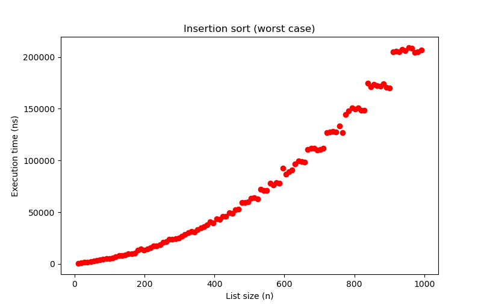
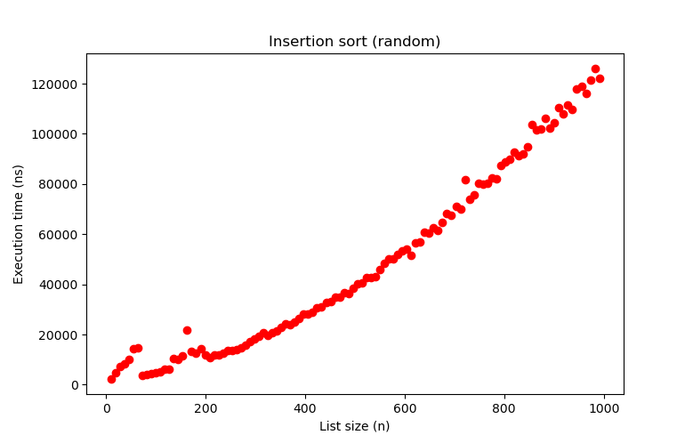
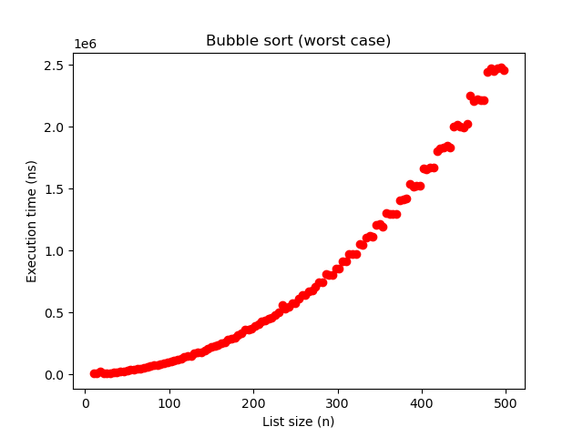
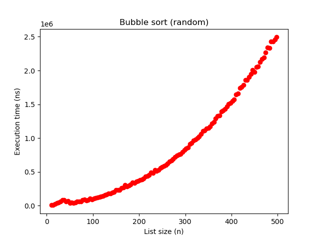
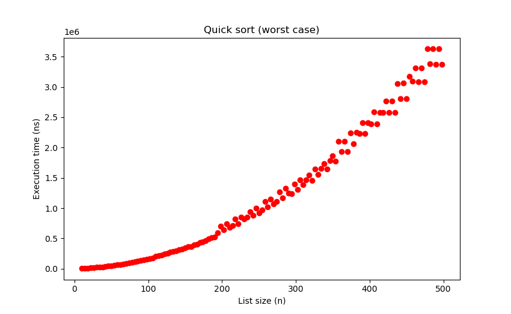

# TP2

Dans ce TP, nous allons réutiliser les outils que nous avons développés dans le TP1
pour étudier quelques algorithmes classiques de tri.

Pour chaque algorithme, notre objectif est de :

- L'implémenter et le tester sur un exemple simple
- Réfléchir aux entrées qui correspondent aux exécutions rapides et lentes (meilleur cas / pire cas) et la complexité associée
- Tracer la courbe de temps correspondant au pire cas et vérifier que ça correspond à votre intuition
- Réfléchir à optimiser l'algorithme ! Pour chaque algo il y a des gains de temps significatifs à faire.

## Algorithmes à implémenter (ordre au choix)

> Cf. [algos.py](./algos.py)

To see it in action:

```bash
cd ..
python3 -m TP2
```

### Tri par insertion

Créer un tableau vide, et y insérer chaque élément du tableau d'entrée un par un à la bonne position.

#### Pire cas



#### Cas aléatoire



### Tri par bulles

Passer sur le tableau entier en inversant les variables voisines quand elles sont en désordre. Recommencer jusqu'à ce que le tableau soit trié.

#### Pire cas



#### Cas aléatoire



### Tri rapide

Prendre le premier élément (le pivot) et séparez le tableau d'entrée en deux tableaux : les plus grands et les plus petits que le pivot. Rappelez la fonction récursivement pour trier les deux tableaux. Concaténez les résultats.

#### Pire cas



#### Cas aléatoire


### Tri fusion

Couper le tableau en deux, trier chaque moitié récursivement, puis combiner les deux tableaux triés ensemble.

> Si vous avez terminé, vous pouvez essayer d'autres tris ou essayer d'inventer le vôtre et d'appliquer la même démarche.
