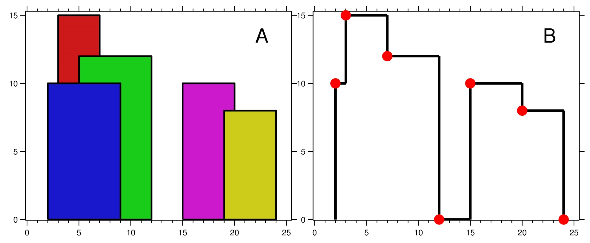

# TP4

L'objectif de ce TP est de choisir entre plusieurs
solutions algorithmiques pour des problèmes simples
et moins simples - sous l'angle de la complexité.

## Q1

Dans une liste donnée en entrée, on cherche à
trouver un creux : un élément dont les voisins sont
plus grands que lui (s'il est au bord, un seul voisin
suffit).

Ecrire un algorithme naïf pour trouver un creux en
temps (au pire) $O(n)$.

```python
def creux_naif(li: list) -> int:
	assert(len(li) >= 2)

	# Bords
	if li[1] > li[0]: return 0
	if li[-2] > li[-1] return len(li) - 1

	# Parcours
	for i in range(1, len(li)-1):
		if li[i-1] > li[i] and li[i+1] > li[i]:
			return i
	return -1
```

Pensez-vous qu'on peut faire plus rapide ?

```python
def creux(li: list) -> int:
	assert(len(li) >= 2)

	# Bords
	if li[1] > li[0]: return 0
	if li[-2] > li[-1]: return len(li) - 1

	# Recherche dichotomique
	left, right = 0, len(li) - 1

	while left <= right:
		mid = (left + right) // 2

		# Vérifier si mid est un creux
		if (mid == 0 or li[mid-1] > li[mid]) and \
			(mid == len(li)-1 or li[mid+1] > li[mid]):
			return mid

		# Si le voisin gauche est plus petit, aller à gauche
		if mid > 0 and li[mid-1] < li[mid]:
			right = mid - 1
		else:
			left = mid + 1

	return -1
```

## Q2

Compter des occurrences dans un tableau.

- Ecrire un algorithme qui compte les occurrences
d'un élément donné en entrée dans un tableau,
en vous convaincant qu'on ne peut pas faire plus
rapide.
- Faites de même dans un tableau trié.
- Si l'entrée n'est pas triée, est-ce intéressant
de trier le tableau avant de compter ?

```python
def occurences(li: list[int], elem: int) -> int:
	count = 0
	for x in li:
		if x == elem:
			count += 1
	return count
	# Ou return li.count(elem)
```

```python
def occurences_sorted(li: list[int], elem: int) -> int:
	def find_left(li, elem):
		left, right = 0, len(li)
		while left < right:
			mid = (left + right) // 2
			if li[mid] < elem:
				left = mid + 1
			else:
				right = mid
		return left

	def find_right(li, elem):
		left, right = 0, len(li)
		while left < right:
			mid = (left + right) // 2
			if li[mid] <= elem:
				left = mid + 1
			else:
				right = mid
		return left

	left_idx = find_left(li, elem)
	right_idx = find_right(li, elem)
	
	return right_idx - left_idx
```

## Q3

On va écrire des programme pour calculer $x^n$
sans utiliser `pow`. Pour faire simple, on ne
va considérer que le temps pris par les
multiplications.

- Etant donnés $n$ et $x$ en entrée, écrire
l'algorithme naïf pour calculer $x^n$.
- Combien de multiplications sont nécessaires
(en fonction de $n$) ?
- Essayez de calculer $x^8$, $x^9$, $x^7$,
$x^{13}$ avec le moins de multiplications
possibles.
- Essayez d'en déduire un algorithme général
plus rapide que le précédent (indice : regardez
le développement binaire de $n$).
- Combien de multiplications sont nécessaires
(en fonction de $n$) ?

```python
def power_naif(x: int, n: int) -> int:
  result = 1
  for _ in range(n): result *= x
  return result
```

```python
def power(x: int, n: int) -> int:
	if n == 0: return 1
	if n == 1: return x

	result = 1
	base = x

	while n > 0:
		if n % 2 == 1: result *= base
		base *= base
		n //= 2
	
	return result
```

## Q4

Problème de l'horizon.

On reçoit en entrée une série de triplets
($a$, $b$, $c$) qui représentent un immeuble
de $c$ étages situé entre les positions $a$
et $b$.

L'objectif est de déterminer la hauteur de
l'horizon à chaque coordonnée.



Un exemple (tiré de [leetcode.com](https://leetcode.com/problems/the-skyline-problem/description/)):

L'immeuble bleu est $(2, 9, 10)$. La sortie
commence par $(0, 0)$, $(1, 0)$, $(2, 10)$...

- Cherchez un algorithme qui, étant donné $k$,
calcule la hauteur de l'horizon à la coordonnée
$k$ en temps linéaire.
- Cherchez un algorithme qui calcule tout l'horizon
en temps *quasilinéaire*.

```python
def skyline_lin(x: int, n: int) -> int:
	TODO
```

```python
def skyline(x: int, n: int) -> int:
	TODO
```
